# Ops Tower - Complete System Architecture

## Architecture Overview

Ops Tower is a comprehensive, cloud-native rideshare platform built with microservices architecture, featuring advanced AI fraud detection, real-time processing, and Philippines-specific optimizations.

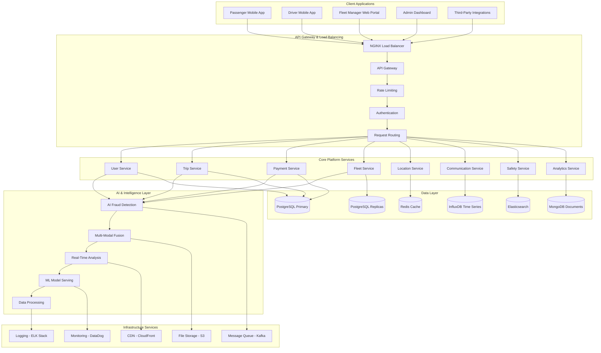

## Microservices Architecture

### 1. Service Decomposition

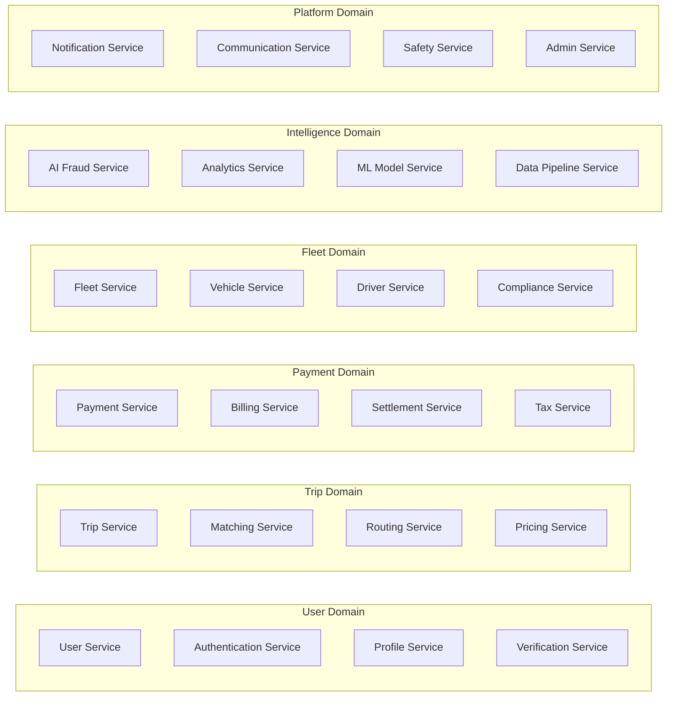

### 2. Service Mesh Architecture

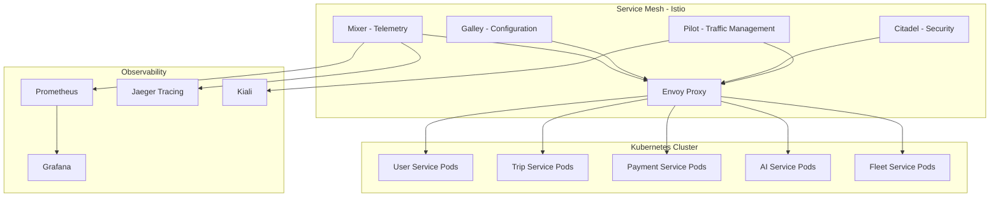

## Data Architecture

### 1. Database Strategy

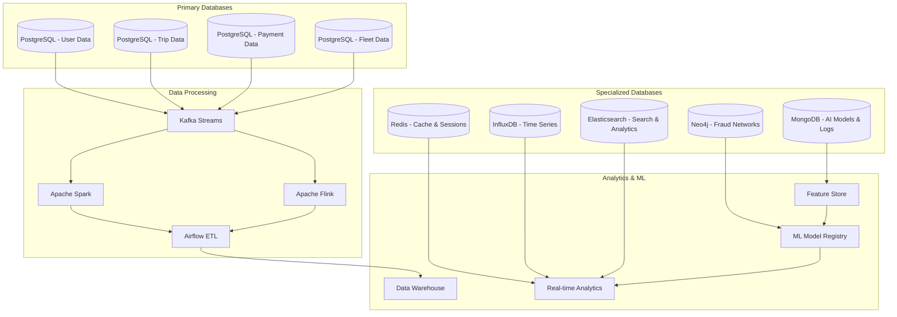

### 2. Data Flow Architecture

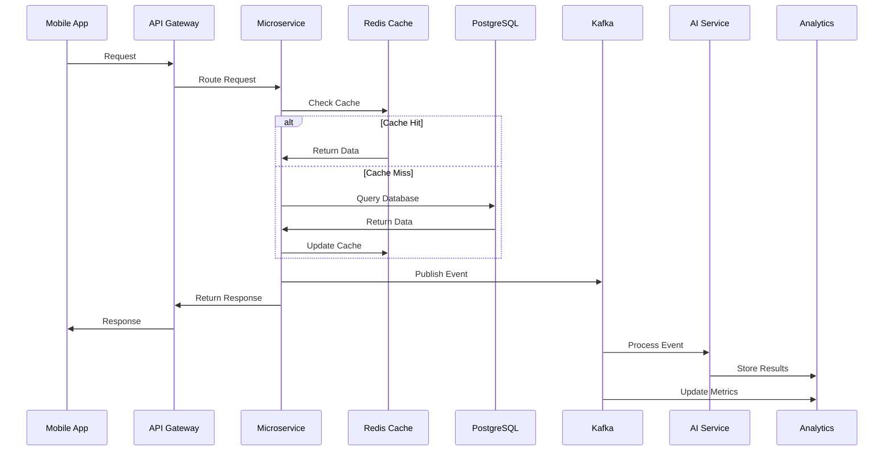

## AI & Machine Learning Infrastructure

### 1. AI Processing Pipeline

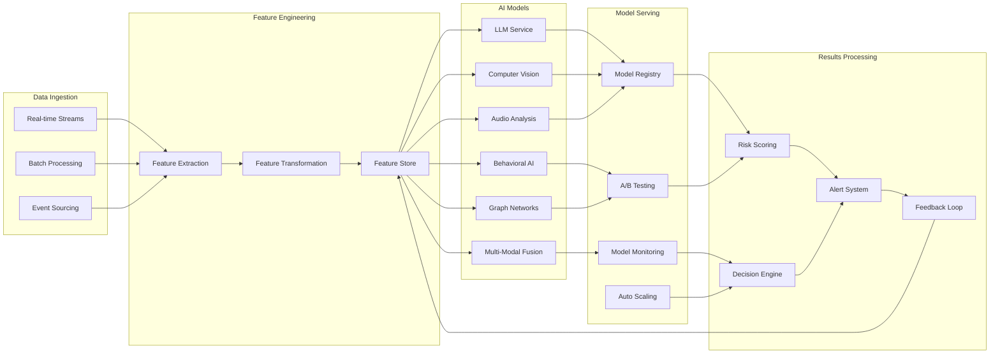

### 2. Real-time Processing Architecture

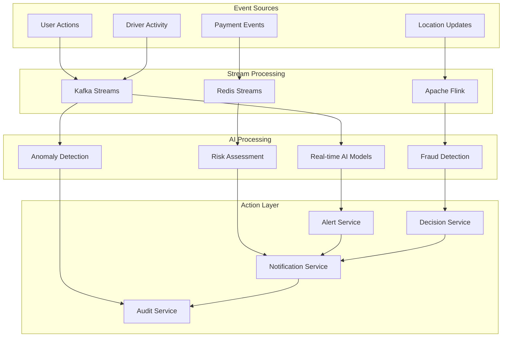

## Security Architecture

### 1. Security Layers

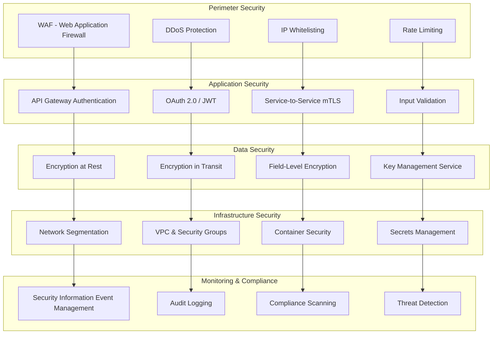

### 2. Authentication & Authorization Flow

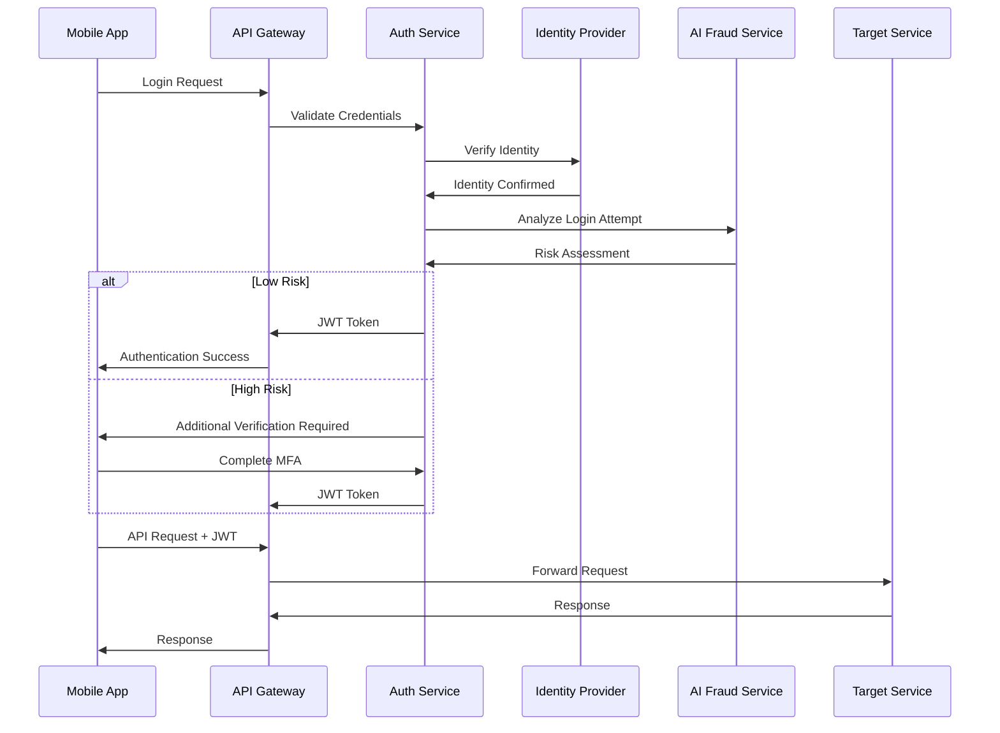

## Philippines-Specific Infrastructure

### 1. Regional Deployment

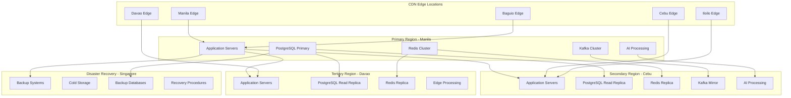

### 2. Compliance & Regulatory Architecture

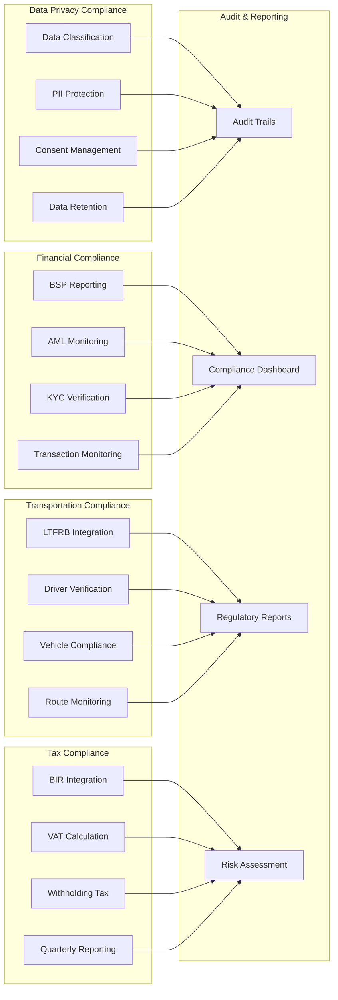

## Performance & Scalability

### 1. Auto-Scaling Strategy

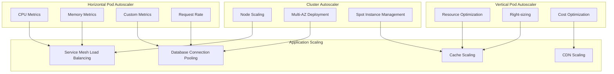

### 2. Caching Strategy

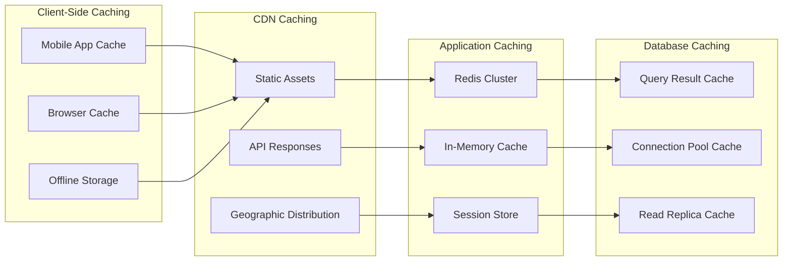

## Monitoring & Observability

### 1. Monitoring Stack

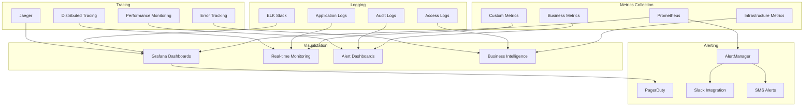

### 2. Health Checks & Circuit Breakers

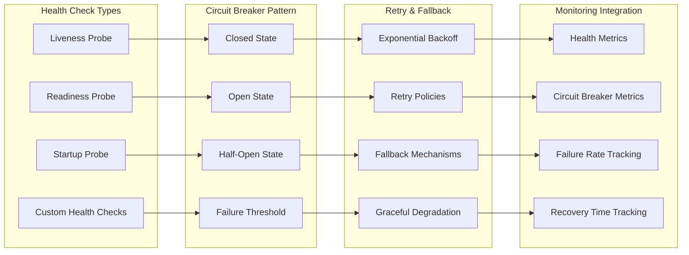

## Disaster Recovery & Business Continuity

### 1. Disaster Recovery Strategy

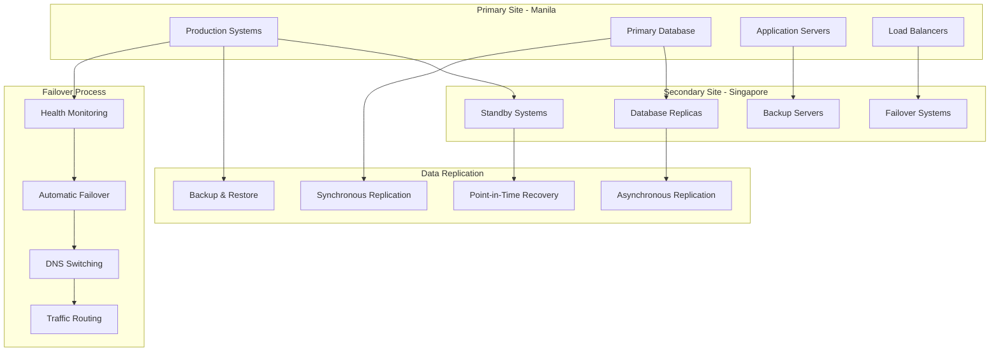

### 2. Backup Strategy

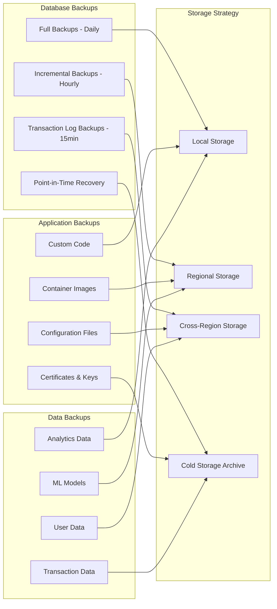

## Cost Optimization

### 1. Resource Optimization

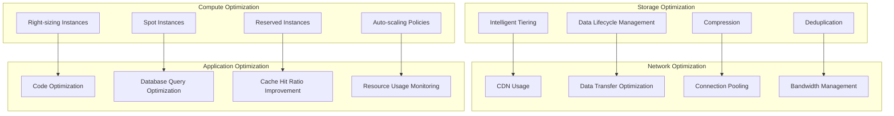

## Technology Stack Summary

### Core Technologies
- **Container Orchestration**: Kubernetes
- **Service Mesh**: Istio
- **API Gateway**: NGINX + Kong
- **Message Broker**: Apache Kafka
- **Databases**: PostgreSQL, Redis, InfluxDB, Elasticsearch
- **Caching**: Redis Cluster
- **Search**: Elasticsearch
- **Monitoring**: Prometheus + Grafana
- **Logging**: ELK Stack
- **Tracing**: Jaeger

### AI & ML Stack
- **ML Framework**: TensorFlow, PyTorch
- **Model Serving**: TensorFlow Serving, Seldon
- **Feature Store**: Feast
- **ML Pipeline**: Kubeflow, MLflow
- **Data Processing**: Apache Spark, Flink
- **Real-time AI**: Kafka Streams, Redis Streams

### Philippines-Specific Integrations
- **Payment Gateways**: GCash, PayMaya, BDO, BPI
- **Government APIs**: LTFRB, BIR, BSP, NBI
- **Mapping Services**: Google Maps (Philippines), Waze
- **Telecom Partners**: Globe, Smart, DITO, Sun

### Security & Compliance
- **Identity Provider**: Auth0, Keycloak
- **Secrets Management**: HashiCorp Vault
- **Certificate Management**: Let's Encrypt, AWS Certificate Manager
- **Security Scanning**: Twistlock, Aqua Security
- **Compliance**: GDPR, Data Privacy Act, BSP Guidelines

This comprehensive system architecture ensures scalability, reliability, security, and compliance while providing advanced AI-powered fraud detection capabilities specifically designed for the Philippines rideshare market.

---

**Architecture Version**: 1.0  
**Last Updated**: 2025-08-30  
**Target Market**: Philippines  
**Compliance**: Full regulatory alignment with BSP, LTFRB, BIR, and Data Privacy Act