# System Architecture Documentation

## High-Level Architecture Diagram

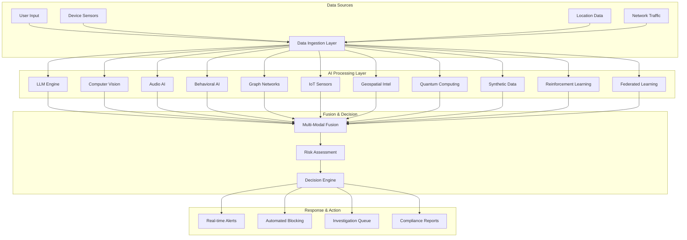

## Detailed Component Architecture

### 1. Data Ingestion & Preprocessing

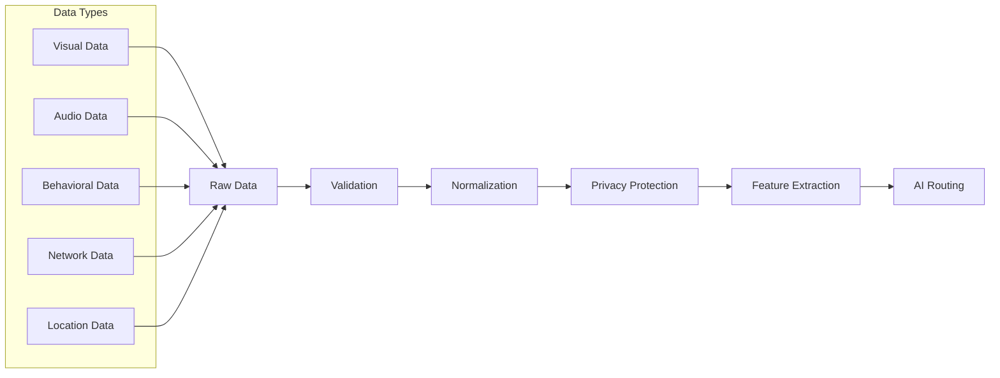

### 2. AI Processing Pipeline

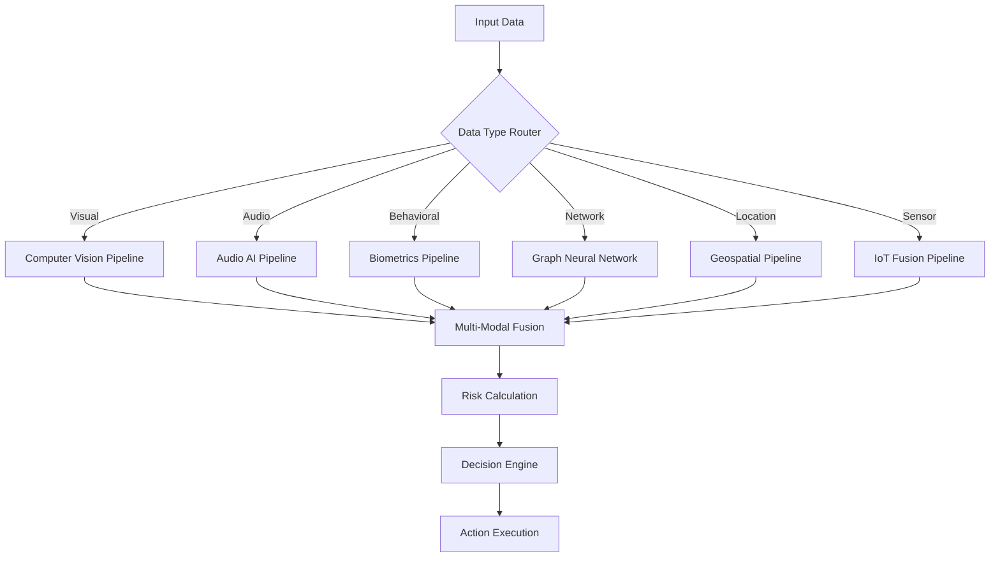

### 3. Multi-Modal Fusion Architecture

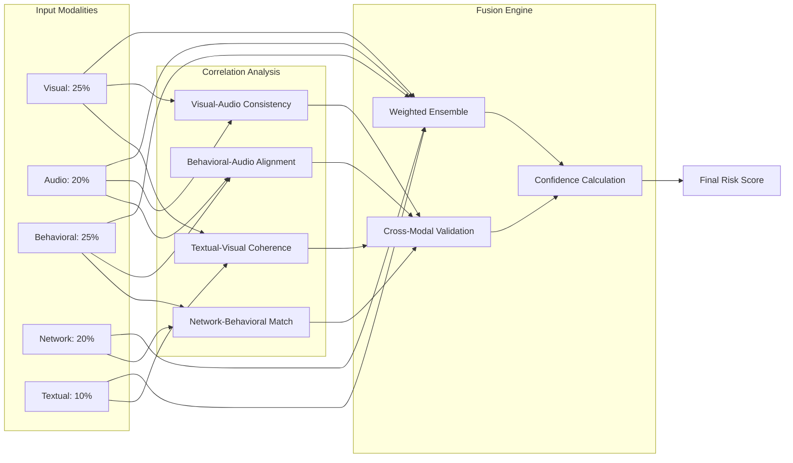

## Data Flow Diagrams

### Real-Time Fraud Detection Flow

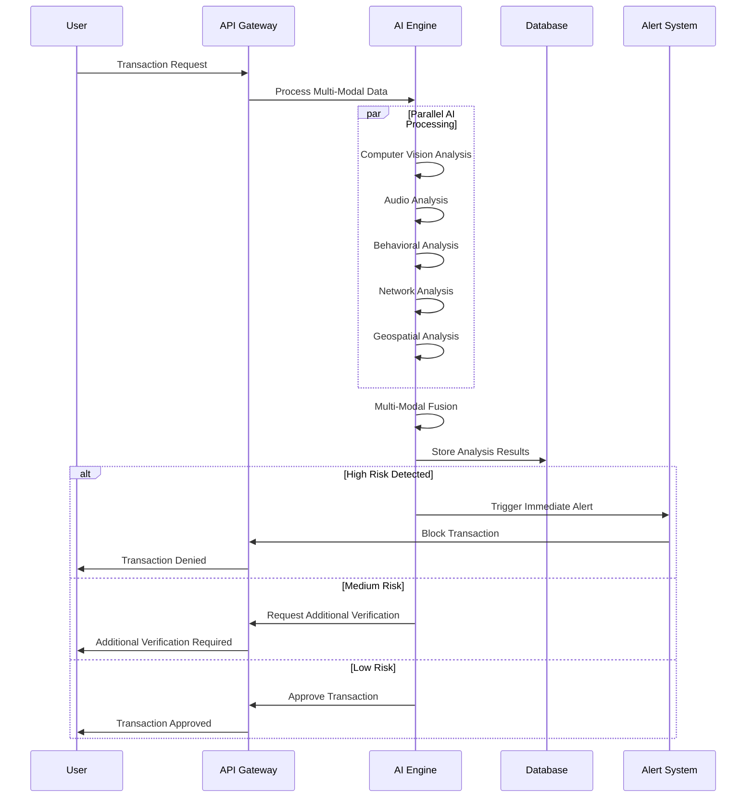

### Federated Learning Flow

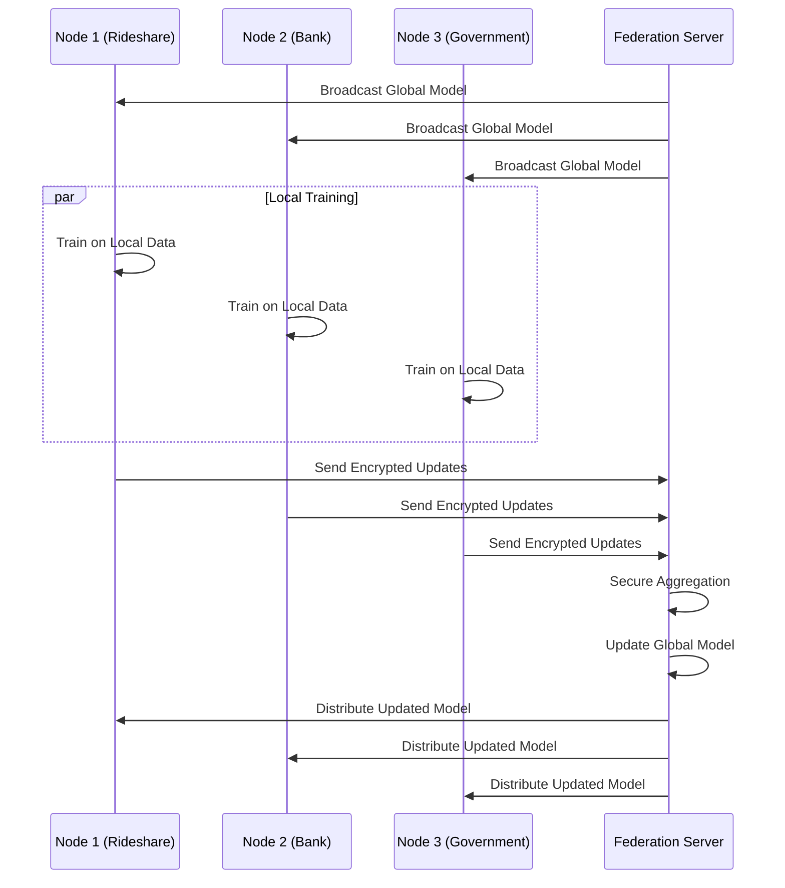

## Component Integration Map

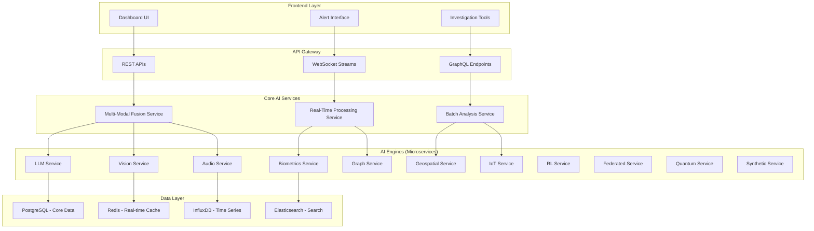

## Deployment Architecture

### Cloud Infrastructure

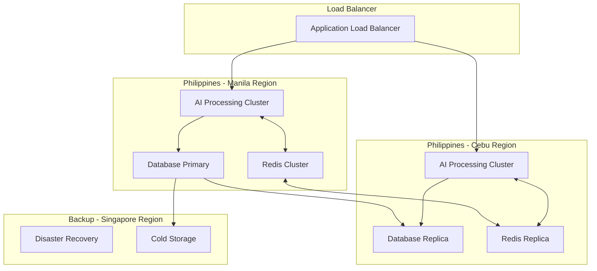

### Microservices Deployment

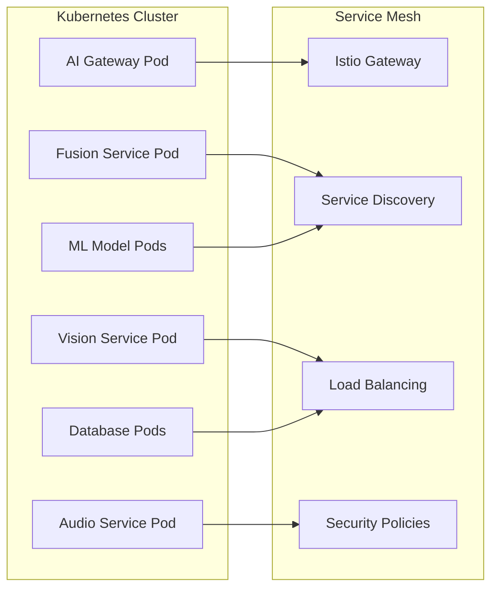

## Monitoring & Observability

### System Health Monitoring

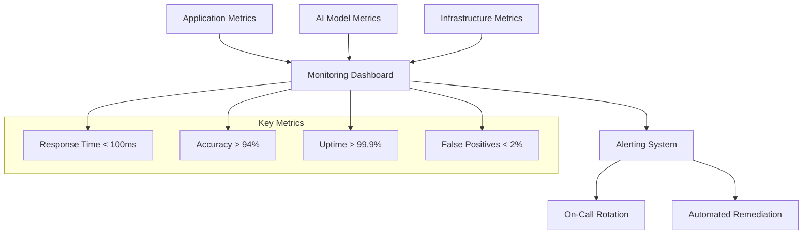

### AI Model Performance Tracking

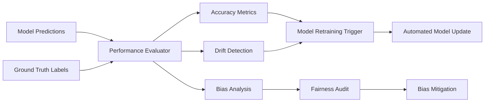

## Security Architecture

### Data Protection Flow

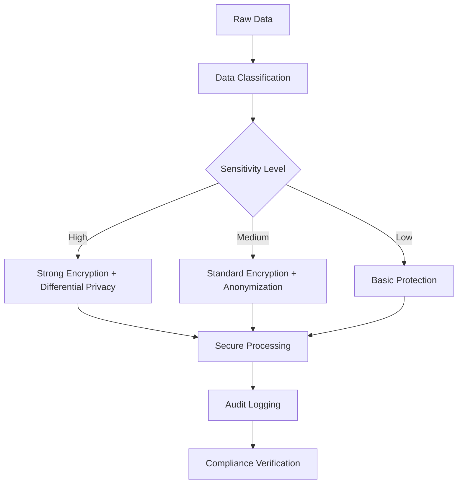

### Access Control Matrix

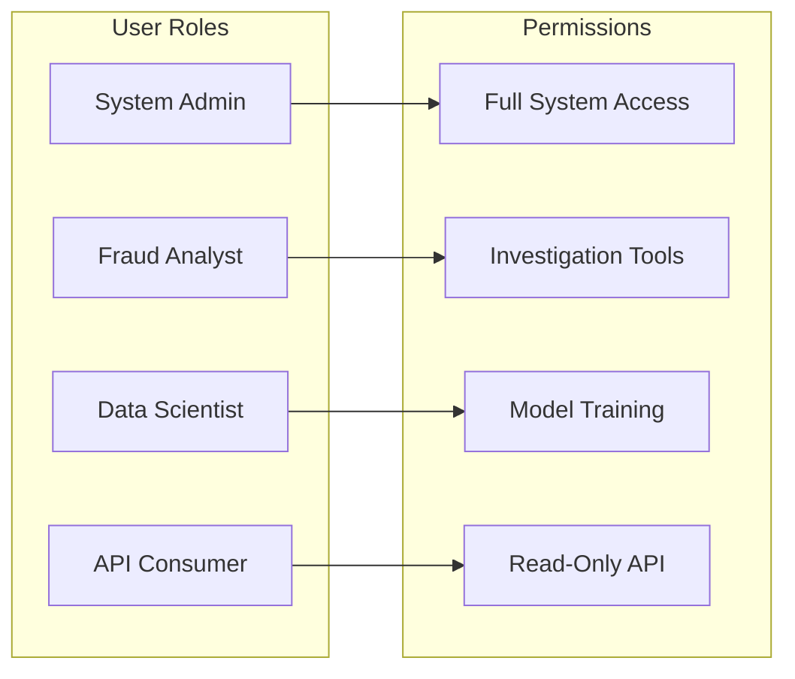

## Philippines Regulatory Compliance

### Data Flow Compliance

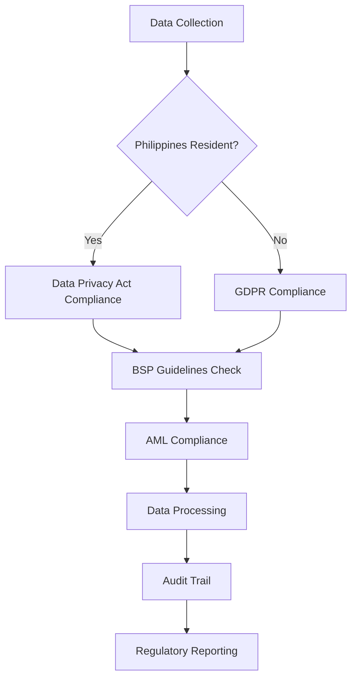

This documentation provides stakeholders with complete technical understanding and implementation guidance for the AI fraud detection system.