# Ops Tower - User Flows & Journey Documentation

## User Journey Maps

### 1. Passenger Journey Flow

#### 1.1 New Passenger Onboarding
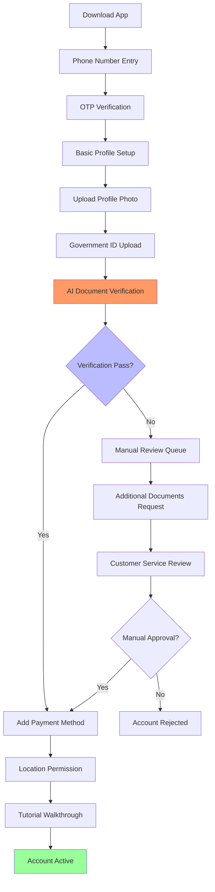

#### 1.2 Booking a Ride Flow
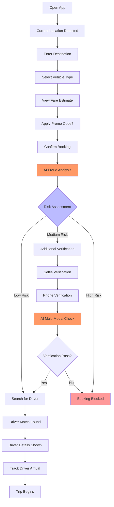

#### 1.3 During Trip Experience
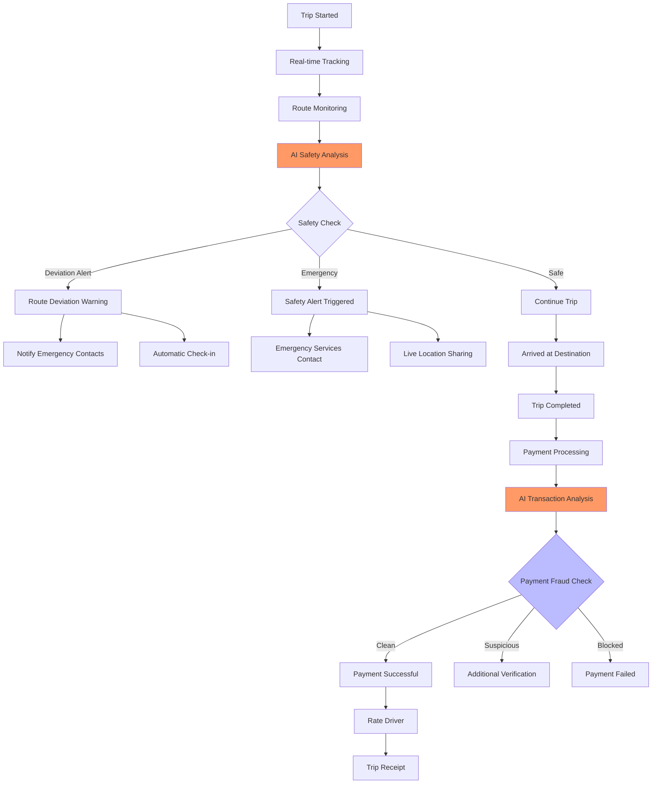

### 2. Driver Journey Flow

#### 2.1 Driver Onboarding Process
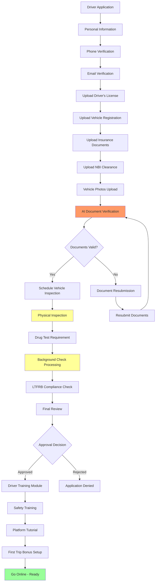

#### 2.2 Driver Going Online Flow
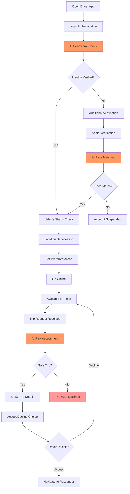

#### 2.3 Trip Execution Flow
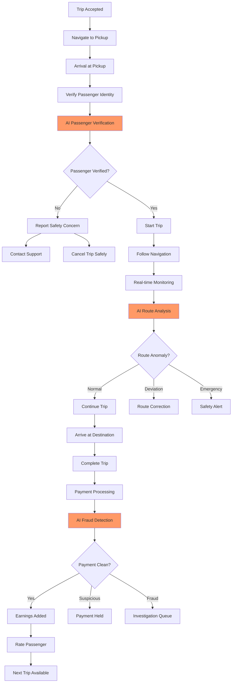

### 3. Fleet Manager Journey

#### 3.1 Fleet Onboarding
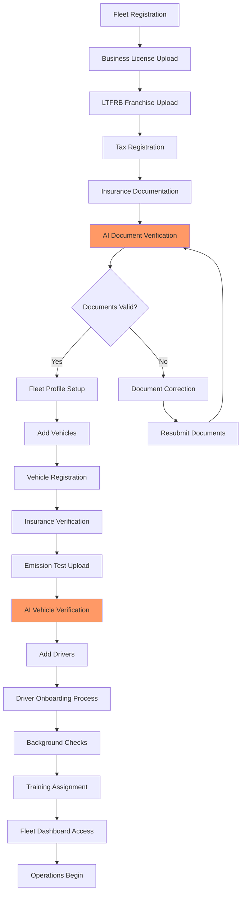

#### 3.2 Daily Fleet Operations
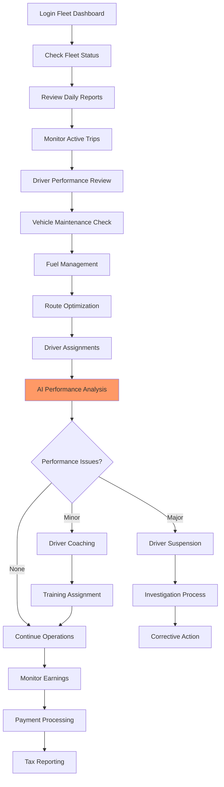

### 4. Emergency Scenarios

#### 4.1 Passenger Emergency Flow
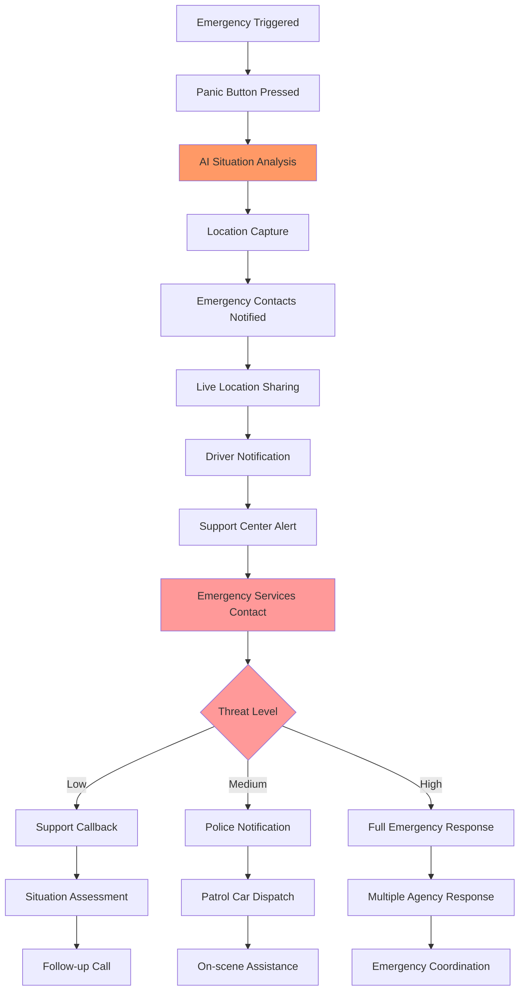

#### 4.2 Driver Emergency Flow
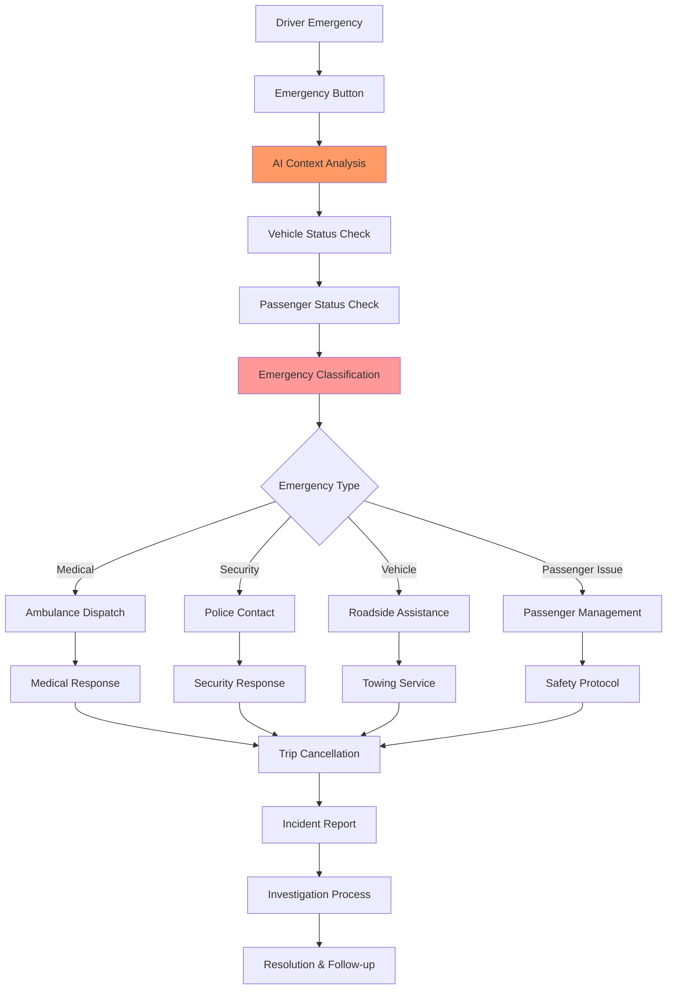

### 5. Fraud Detection User Flows

#### 5.1 Real-time Fraud Detection
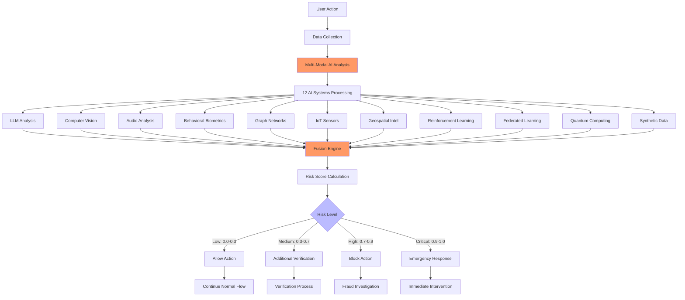

#### 5.2 Investigation Workflow
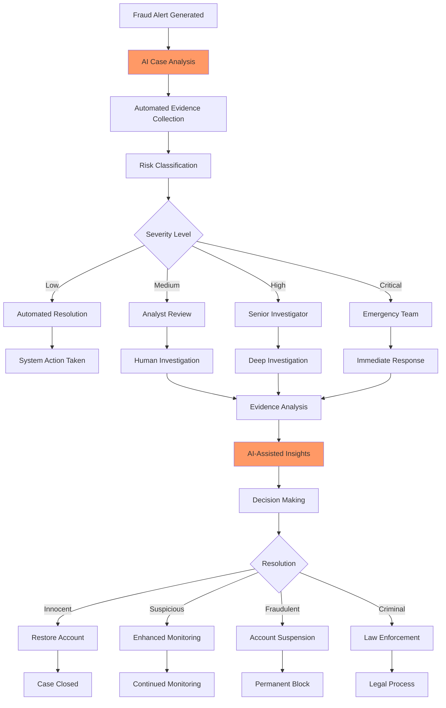

## User Experience Considerations

### 1. Mobile App UX Principles

#### Philippines-Specific Design Elements
- **Language Support**: English, Tagalog, Cebuano, Ilocano
- **Cultural Adaptation**: Family-oriented features, bayanihan spirit
- **Connectivity Optimization**: Works on 2G/3G networks
- **Data Conservation**: Minimal data usage options
- **Offline Capabilities**: Core features work without internet

#### Accessibility Features
- **Vision Impaired**: Voice commands, screen reader support
- **Hearing Impaired**: Visual alerts, vibration patterns
- **Motor Impaired**: Large buttons, voice input
- **Elderly Users**: Simplified interface, larger fonts
- **Low Literacy**: Icon-based navigation, audio instructions

### 2. Safety-First Design Philosophy

#### Visual Safety Indicators
```typescript
interface SafetyIndicators {
  driverVerification: {
    greenShield: 'Fully Verified';
    yellowShield: 'Basic Verification';
    redX: 'Verification Issues';
  };
  
  tripSafety: {
    safeRoute: 'Green Route Line';
    moderateRisk: 'Yellow Route Line';
    highRisk: 'Red Route Line';
  };
  
  emergencyAccess: {
    panicButton: 'Always Visible';
    quickDial: 'One-Touch Emergency';
    locationSharing: 'Automatic Safety';
  };
}
```

### 3. Performance Optimization

#### Fast Loading Strategies
- **App Launch**: < 3 seconds cold start
- **Trip Booking**: < 5 seconds end-to-end
- **Driver Matching**: < 30 seconds average
- **Payment Processing**: < 10 seconds completion
- **AI Analysis**: < 100ms fraud detection

#### Network Resilience
- **Offline Mode**: Core features available
- **Low Bandwidth**: Optimized for slow connections
- **Connection Recovery**: Automatic retry mechanisms
- **Data Sync**: Background synchronization
- **Cache Strategy**: Smart local storage

### 4. Trust Building Elements

#### Transparency Features
- **Real-time Updates**: Trip progress, pricing, ETA
- **Driver Information**: Photo, rating, vehicle details
- **Pricing Breakdown**: Clear fare calculation
- **Safety Features**: Visible protection measures
- **Support Access**: Easy help and communication

#### Verification Badges
- **Background Verified**: Criminal record check passed
- **Document Verified**: All documents AI-validated
- **Experience Badge**: Years of safe driving
- **Rating Badge**: High customer satisfaction
- **Training Badge**: Safety training completed

## Integration Touch Points

### 1. Cross-Platform Consistency
- **Design System**: Unified UI components
- **User Data**: Synchronized across devices
- **Feature Parity**: Consistent functionality
- **Performance Standards**: Equal response times
- **Security Measures**: Same protection level

### 2. Third-Party Integration UX
- **Payment Flows**: Seamless wallet integration
- **Maps Integration**: Smooth navigation experience
- **Social Features**: Easy sharing and referrals
- **Government Services**: Streamlined verification
- **Emergency Services**: Direct access and coordination

### 3. Business Logic Integration
- **Fraud Detection**: Invisible to honest users
- **Surge Pricing**: Clear communication and justification
- **Promotions**: Contextual offers and discounts
- **Loyalty Programs**: Progressive rewards and benefits
- **Fleet Management**: Seamless driver-fleet coordination

This comprehensive user flow documentation ensures all stakeholders understand the complete user experience across the entire platform, from onboarding through daily operations to emergency scenarios, all enhanced by advanced AI fraud detection capabilities.

---

**Document Version**: 1.0  
**Focus**: Complete User Experience  
**Region**: Philippines Market  
**AI Integration**: 12 Advanced Fraud Detection Systems